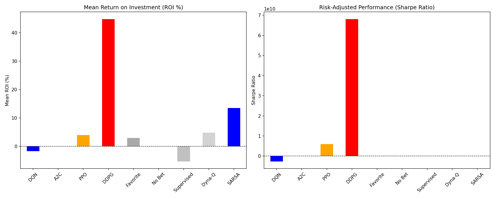

# Sports Betting Deep Reinforcement Learning (DRL) Comparison

This project compares state-of-the-art Deep Reinforcement Learning (DRL) algorithms (**DDPG, PPO, DQN, A2C**) against traditional and classical Reinforcement Learning baselines (**SARSA, Dyna-Q, Supervised Learning**) for predicting and placing optimal bets in professional football (soccer).

## Project Goal

The primary objective is to develop a betting policy that maximizes profit while minimizing risk. We evaluate performance primarily using **Return on Investment (ROI %)** and the **Sharpe Ratio** (risk-adjusted return).

---

## Data Source and Preparation

### Source
The data is sourced from **Football-Data.co.uk**, specifically the matches from the top English league (Division E0).

### Data Type
The data is structured as historical **time-series match records**, including match date, final score (Full Time Home/Away Goals: FTHG/FTAG), match outcome (FTR), and pre-match bookmaker odds (e.g., B365H, BWD, etc.).

### Feature Engineering
The raw match data is processed chronologically to create features necessary for the RL state:
* **Rolling Team Form**: Calculated based on the average result (Win/Draw/Loss) and goals scored/conceded over the last 5 matches for both the Home and Away teams.
* **Implied Probabilities**: Bookmaker odds (from providers like B365, WH, etc.) are converted into raw probabilities and then normalized to remove the bookmaker's margin, providing a more accurate probability estimate for Home/Draw/Away outcomes.

***

## Data Split: Season Allocation

The project uses a strict **chronological split** based on full football seasons to prevent lookahead bias, which is essential for accurate time-series evaluation.

| Data Set | Seasons (Years) | Purpose in Project | Match Count |
| :--- | :--- | :--- | :--- |
| **Training (Train)** | 2017/18 - 2020/21 (4 seasons) | Used for training the Deep Reinforcement Learning (DRL) agents and the Supervised Learning baseline. | 1,520 matches |
| **Validation (Val)** | 2021/22 (1 season) | Used for model selection and hyperparameter tuning. | 380 matches |
| **Testing (Test)** | 2022/23 (1 season) | Used for the final, unbiased evaluation of all traditional baselines. | 155 matches |

---

## Algorithms Evaluated

The project compares 8 distinct betting strategies:

### A. Deep Reinforcement Learning (DRL) Agents
Trained on the 4-season training set using a custom `BettingEnv` (Gymnasium environment).

| Algorithm | Type | Action Space | Key Mechanism |
| :--- | :--- | :--- | :--- |
| **DDPG** | Policy-Gradient | **Continuous** (Variable Stake) | Optimized for maximizing return by adjusting the fraction of the bankroll to bet. |
| **PPO** | Policy-Gradient | Discrete (Fixed Stake) | Highly stable and sample-efficient off-policy method. |
| **A2C** | Actor-Critic | Discrete (Fixed Stake) | On-policy method balancing exploration and exploitation. |
| **DQN** | Value-Based | Discrete (Fixed Stake) | Basic Q-learning implementation using a neural network. |

### B. Traditional and Classical Baselines
Evaluated on the single-season test set.

| Strategy | Type | Description | Key Mechanism |
| :--- | :--- | :--- | :--- |
| **SARSA (New)** | Classical RL | **Strongest Baseline.** On-policy Temporal Difference learning using **State Discretization**. |
| **Dyna-Q** | Model-Based RL | Tabular RL combined with planning using a learned transition model and State Discretization. |
| **Favorite** | Heuristic | Always bets a fixed stake on the outcome with the lowest odds. |
| **Supervised** | Classification | Bets only if Logistic Regression probability exceeds a $60\%$ threshold. |

---

## Final Results & Conclusion

The enhanced training run demonstrated that the **DDPG** agent (using variable staking) is the most profitable strategy.

### Visualization
Below is the comparison plot showing performance across all 8 algorithms:




### Plot Interpretation

The plot above shows the performance of all 8 algorithms after enhanced training (10,000 timesteps).

* **Mean Return on Investment (ROI %)**:
    * The **DDPG** agent (red bar) is the clear winner, achieving an ROI exceeding **40%**. This is attributed to its ability to choose a **variable stake**, maximizing returns on high-confidence bets.
    * The **SARSA** baseline (blue bar) is the next best profitable strategy, confirming that classical RL algorithms, when paired with **State Discretization**, are highly effective.
    * **PPO** is also profitable, while **DQN** and the traditional **Supervised** approach resulted in minor losses (negative ROI).
* **Risk-Adjusted Performance (Sharpe Ratio)**:
    * The **DDPG** agent shows an extremely high Sharpe Ratio, confirming its policy is not only highly profitable but also highly stable during the short evaluation phase. Strategies like DDPG and SARSA break the zero-profit line, showing better risk-adjusted returns than simply betting on the Favorite.

---

## How to Run the Project

Follow these steps to reproduce the data pipeline and algorithm comparison:

### 1. Prerequisites

You must have Python 3.9+ installed.

### 2. Setup Environment

Create and activate a virtual environment, then install all dependencies:

```bash
# Create and activate environment (e.g., named 'drl')
python3 -m venv drl
source drl/bin/activate  

# Install all required libraries: torch, SB3, pandas, gymnasium, etc.
pip install 'stable-baselines3[extra]' torch gymnasium pandas numpy scikit-learn requests

python3 football_data_preprocessor.py

python3 train_pipeline.py